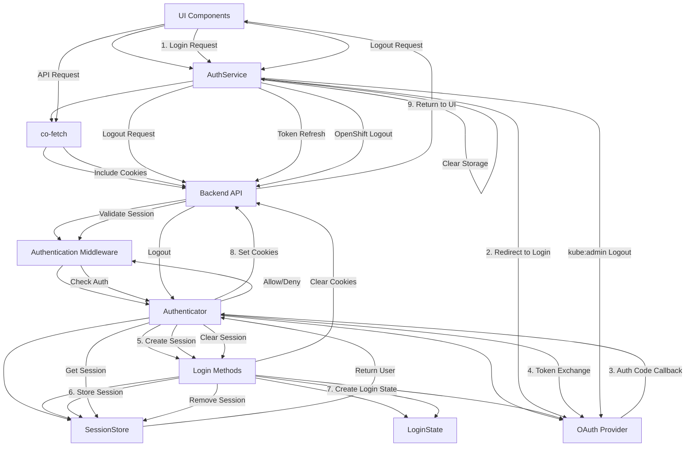

# Authentication Components Relationship Map

## Overview
This document maps the relationships between the various authentication components in the OpenShift console.

## Mermaid Diagram

## Key Component Relationships

### Frontend to Backend
1. **UI Components → AuthService**
   - UI components call AuthService for login, logout, and session info
   - AuthService provides user data to UI components

2. **AuthService → co-fetch**
   - AuthService uses co-fetch for API requests
   - co-fetch automatically includes auth cookies with requests

3. **co-fetch → Backend API**
   - Makes authenticated requests to backend API endpoints
   - Handles 401 responses for token refresh

### Backend Authentication
1. **Authentication Middleware → Authenticator**
   - Middleware intercepts HTTP requests
   - Passes requests to Authenticator for validation

2. **Authenticator → Login Methods**
   - Authenticator delegates provider-specific logic to login methods
   - Different implementations for OpenShift and generic OIDC

3. **Authenticator/Login Methods → SessionStore**
   - Store and retrieve session information
   - Manage session expiration and cleanup

4. **Login Methods → LoginState**
   - Create login state objects from token information
   - Extract user details from tokens

### External Interactions
1. **Authenticator → OAuth Provider**
   - Redirects users to provider for authentication
   - Exchanges authorization codes for tokens

2. **AuthService → OAuth Provider**
   - Special handling for kube:admin logout
   - Direct interaction for OpenShift token deletion

## Data Flow Relationships

### Session Data Flow
- **Token → LoginState**: User data extracted from token
- **LoginState → SessionStore**: Session data persisted server-side
- **SessionStore → Cookies**: Session ID stored in secure cookie
- **Cookies → AuthService**: Frontend reads user data from cookies/local storage

### API Request Authentication Flow
- **Frontend → co-fetch → Backend**: Request with cookie authentication
- **Backend → Middleware → Authenticator**: Authentication validation
- **Authenticator → SessionStore**: Session lookup and validation
- **SessionStore → Authenticator → Middleware**: User information or auth failure
- **Middleware → API Handler**: Proceed with authenticated request

## Implementation Dependencies
1. **AuthService depends on**:
   - Browser local storage
   - co-fetch for API requests
   - Server-provided configuration flags

2. **Authenticator depends on**:
   - HTTP request/response
   - OAuth2 libraries
   - SessionStore for persistence
   - Login methods for provider-specific logic

3. **SessionStore depends on**:
   - In-memory data structures
   - Mutex for thread safety
   - LoginState objects

4. **LoginState depends on**:
   - Token claims parsing
   - Time utilities for expiration
