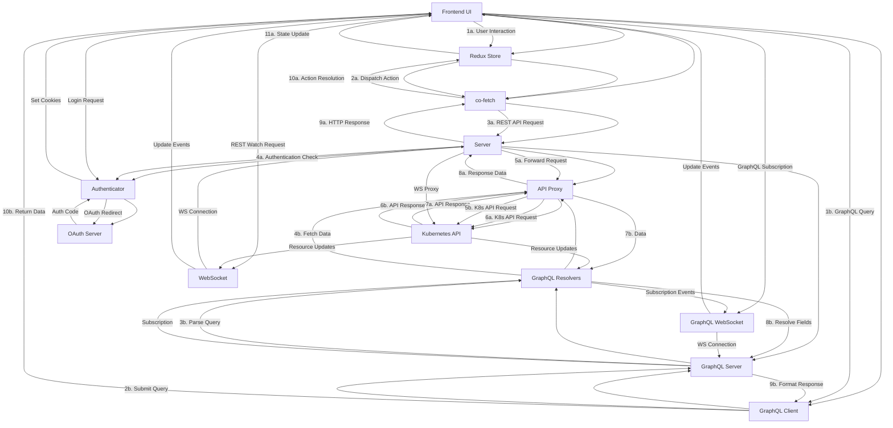

# Frontend-Backend Interaction Map

## Overview
This document maps the relationships and interactions between the frontend and backend components of the OpenShift console.

## Mermaid Diagram

## Key Interaction Points

### HTTP API Requests
1. **Frontend → Backend (REST)**
   - Frontend makes HTTP requests via `co-fetch`
   - Requests include authentication cookies
   - Structured around Kubernetes API resources

2. **Frontend → Backend (GraphQL)**
   - Frontend makes GraphQL queries to `/graphql` endpoint
   - Provides precise field selection and structured queries
   - Handles permissions checks and URL fetching

3. **Backend → Kubernetes API**
   - Backend proxies requests to Kubernetes API
   - Adds authentication headers
   - Handles request/response transformation

### WebSocket Connections
1. **Frontend → Backend (REST Watch)**
   - Frontend establishes WebSocket connection for watches
   - Connection authenticated with same cookies as HTTP
   - Used for real-time updates to resources

2. **Frontend → Backend (GraphQL Subscriptions)**
   - Frontend establishes WebSocket for GraphQL subscriptions
   - Follows GraphQL over WebSocket protocol
   - Provides real-time data with field selection

3. **Backend → Kubernetes API**
   - Backend establishes proxy WebSocket to Kubernetes
   - Forwards events from Kubernetes to frontend
   - Maintains connection lifecycle

### Authentication Flows
1. **Frontend Login Process**
   - Frontend redirects to login endpoint
   - Backend redirects to OAuth provider
   - OAuth callback processed by backend
   - Session established with cookies
   - Frontend reads user info from localStorage

2. **Request Authentication**
   - Frontend includes cookies in each request
   - Backend validates session on each request
   - Backend refreshes tokens as needed
   - 401 responses trigger token refresh

### Static Assets
1. **Backend → Frontend**
   - Backend serves static frontend assets
   - Assets bundled during build process
   - Frontend loads and executes in browser

## Data Flow Patterns

### REST API Pattern
- **Request**: Frontend → Backend → Kubernetes API
- **Response**: Kubernetes API → Backend → Frontend
- **Data Format**: JSON (Kubernetes resources)

### GraphQL API Pattern
- **Request**: Frontend → GraphQL Server → Resolvers → Kubernetes API
- **Response**: Kubernetes API → Resolvers → GraphQL Server → Frontend
- **Data Format**: JSON (shaped according to query)

### Watch API Pattern
- **Connection**: Frontend ⟷ Backend ⟷ Kubernetes API
- **Events**: Kubernetes API → Backend → Frontend
- **Data Format**: JSON events (added/modified/deleted)

### GraphQL Subscription Pattern
- **Connection**: Frontend ⟷ GraphQL Server ⟷ Resolvers
- **Events**: Kubernetes API → Resolvers → GraphQL Server → Frontend
- **Data Format**: JSON (shaped according to subscription)

### Authentication Pattern
- **Login**: Frontend → Backend → OAuth → Backend → Frontend
- **Validation**: Frontend request → Backend check → Response
- **Refresh**: Backend detects expiration → Gets new token → Updates session

## Implementation Dependencies
1. **Frontend depends on Backend for**:
   - API proxying to Kubernetes
   - GraphQL interface for efficient queries
   - Authentication with OAuth
   - Serving static assets
   - WebSocket proxying for watches and subscriptions

2. **Backend depends on**:
   - Kubernetes API server
   - OAuth server
   - Frontend build artifacts

3. **Both depend on**:
   - Common understanding of resource formats
   - HTTP/WebSocket protocols
   - Authentication mechanism
   - GraphQL schema definitions

## Communication Protocols
1. **HTTP/HTTPS**:
   - Used for most API requests
   - RESTful interaction with resources
   - GraphQL queries and mutations
   - JSON data format

2. **WebSockets**:
   - Used for real-time updates
   - Persistent connections
   - Event-based messages
   - GraphQL subscriptions

3. **Server-Sent Events**:
   - Alternative to WebSockets in some cases
   - One-way server-to-client updates

## Error Handling
1. **Network Errors**:
   - Frontend detects and retries
   - Shows error notifications for persistent failures

2. **Authentication Errors**:
   - Backend returns 401/403 status codes
   - Frontend triggers token refresh or logout

3. **API Errors**:
   - Kubernetes error responses passed through
   - Frontend displays formatted error details

4. **GraphQL Errors**:
   - Structured in "errors" field of response
   - Type-safe error handling
   - Detailed error information
   - Supports partial success responses

## Performance Considerations

1. **REST API Optimization**:
   - Resource caching in Redux store
   - Conditional requests with ETag/If-Modified-Since
   - Watch endpoints for incremental updates
   - Request batching where possible

2. **GraphQL Advantages**:
   - Request only needed fields to reduce payload size
   - Combine multiple resource requests in single query
   - Avoid over-fetching of data
   - Strongly typed schema provides predictability
   - Introspection for documentation and tooling

3. **Connection Management**:
   - Connection pooling for HTTP requests
   - WebSocket connection reuse
   - Backoff strategy for reconnections
   - Throttling for high-frequency operations

## Security Aspects

1. **Authentication**:
   - Both REST and GraphQL use same authentication system
   - Cookie-based session management
   - OAuth token handling
   - CSRF protection

2. **Authorization**:
   - GraphQL provides `selfSubjectAccessReview` for permission checks
   - REST API uses Kubernetes RBAC system
   - Field-level authorization in GraphQL responses
   - Resource-level authorization in REST responses

3. **Transport Security**:
   - HTTPS for all communications
   - WebSocket over TLS
   - HTTP security headers
   - Content Security Policy
