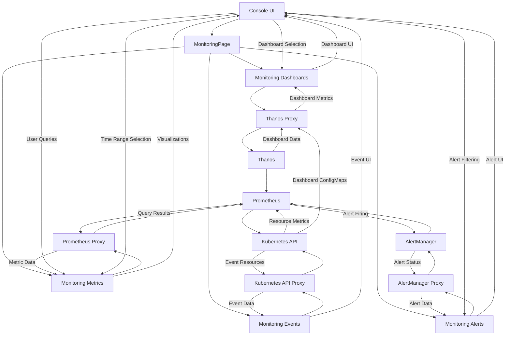

# Monitoring System Relationship Map

## Overview
This document maps the relationships between the various components of the OpenShift console monitoring system, showing how monitoring data flows from Kubernetes resources through Prometheus to the console UI.

## Mermaid Diagram

## Key Component Relationships

### Console UI to Backend
1. **Console UI → Monitoring Pages**
   - User interacts with monitoring UI components
   - Data visualization and interaction

2. **Monitoring Pages → Backend Proxies**
   - Query requests sent to appropriate backend
   - Response data received and processed

3. **Backend Proxies → Monitoring Systems**
   - Requests forwarded to appropriate monitoring system
   - Authentication and tenant isolation applied

### Monitoring Systems Integration
1. **Prometheus ↔ AlertManager**
   - Prometheus evaluates alert rules
   - AlertManager manages alert states and notifications

2. **Prometheus ↔ Thanos**
   - Thanos provides long-term storage for Prometheus data
   - Thanos enables multi-cluster querying

3. **Prometheus/Thanos ↔ Kubernetes API**
   - Prometheus scrapes metrics from Kubernetes components
   - Kubernetes API provides resource and configuration data

## Data Flow Patterns

### Metrics Flow
- **Source → Collection**: Metrics are collected from various sources
- **Storage → Processing**: Metrics are stored and processed by Prometheus/Thanos
- **Query → Response**: Metrics are queried and returned to the UI
- **Visualization → Interaction**: Metrics are visualized and users interact with them

### Alert Flow
- **Rule Evaluation**: Prometheus evaluates alert rules against metrics
- **Alert Firing**: Fired alerts are sent to AlertManager
- **Alert Management**: AlertManager groups, deduplicates, and routes alerts
- **Alert Display**: Console UI displays alerts with status and details

### Dashboard Flow
- **Dashboard Definition**: Dashboards defined in ConfigMaps
- **Dashboard Discovery**: Console discovers dashboard ConfigMaps
- **Dashboard Rendering**: Console renders dashboards with metrics from Prometheus/Thanos
- **Dashboard Interaction**: Users interact with dashboard visualizations

## Implementation Dependencies
1. **Console UI depends on**:
   - React framework
   - Visualization libraries (charts, graphs)
   - API client for data fetching

2. **Backend Proxy depends on**:
   - Go HTTP server
   - Authentication middleware
   - Reverse proxy capabilities

3. **Monitoring Systems depend on**:
   - Prometheus operator
   - AlertManager operator
   - Thanos operator (if used)
   - Kubernetes API server

## Security Model
1. **Authentication**:
   - All monitoring requests authenticated through console
   - Backend proxies add appropriate authentication
   - Multi-tenant access control

2. **Namespace Isolation**:
   - Developer metrics limited to accessible namespaces
   - Admin metrics include cluster-wide visibility
   - Namespace context applied to queries

3. **Access Control**:
   - RBAC controls monitoring access
   - Tenant-aware proxying for multi-tenant clusters
   - View/edit permissions for monitoring resources
