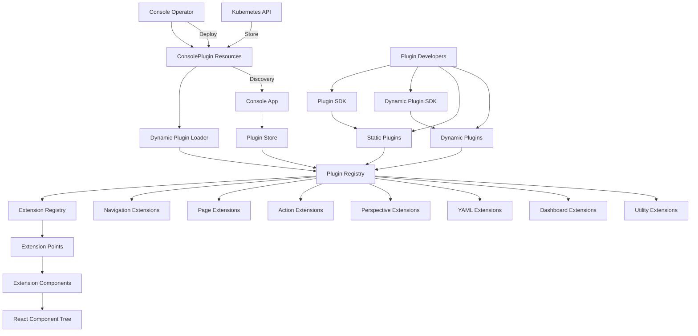

# Plugin System Relationship Map

## Overview
This document maps the relationships between the various components of the OpenShift console plugin system.

## Mermaid Diagram

## Key Component Relationships

### Operator to Console
1. **Console Operator → ConsolePlugin Resources**
   - Operator manages deployment of plugin resources
   - Creates or updates ConsolePlugin custom resources

2. **ConsolePlugin Resources → Dynamic Plugin Loader**
   - Custom resources define plugin metadata
   - Loader discovers plugins from these resources

3. **Dynamic Plugin Loader → Plugin Registry**
   - Loads dynamic plugins at runtime
   - Registers plugin extensions in registry

### Plugin Registration
1. **Static Plugins → Plugin Registry**
   - Built-in plugins register directly
   - Loaded at application startup

2. **Dynamic Plugins → Plugin Registry**
   - Loaded at runtime from external sources
   - Can be added or removed without restart

3. **Plugin Registry → Extension Registry**
   - Plugins provide extensions
   - Extensions are organized by type

### Extension System
1. **Extension Registry → Extension Points**
   - Registry catalogs all available extensions
   - Extension points represent locations in UI

2. **Extension Points → Extension Components**
   - Extension points render components
   - Components come from various plugins

3. **Extension Components → React Component Tree**
   - Plugin components are integrated into React tree
   - Rendered as part of the console UI

### Plugin Development
1. **Plugin Developers → Plugin SDKs**
   - Developers use SDKs to create plugins
   - SDKs provide typings and utilities

2. **Plugin SDK → Static Plugins**
   - Used for built-in or compiled-in plugins
   - Extensions defined in code or JSON

3. **Dynamic Plugin SDK → Dynamic Plugins**
   - Used for runtime-loaded plugins
   - Supports remote loading of plugins

## Data Flow Relationships

### Plugin Loading Flow
- **ConsolePlugin CR → Metadata → Plugin Registry**: Plugin discovery and loading
- **Plugin Registry → Extension Registry → UI**: Extensions integrated into UI

### Extension Resolution Flow
- **Extension Point → Query Registry → Render Components**: Dynamic resolution of extensions
- **Extension Registry → Filter By Perspective → Render**: Context-aware extension display

### Plugin Lifecycle Flow
- **Discovery → Loading → Initialization → Ready**: Plugin startup sequence
- **Deactivation → Cleanup → Unregistration → Unloaded**: Plugin shutdown sequence

## Implementation Dependencies
1. **Plugin Registry depends on**:
   - Plugin metadata schemas
   - Extension point definitions
   - Plugin loading system

2. **Extension Registry depends on**:
   - Plugin registry
   - Extension point definitions
   - React component system

3. **Dynamic Plugin Loader depends on**:
   - Kubernetes API client
   - Module federation or dynamic imports
   - Plugin runtime environment

## Security Model
1. **Trusted Sources**:
   - Plugins can only be loaded from trusted sources
   - ConsolePlugin CRs restricted by RBAC

2. **Isolation**:
   - Plugins operate in browser sandbox
   - Plugin errors don't crash console

3. **Permission Model**:
   - Extensions can be hidden based on user permissions
   - Plugins can check permissions before rendering
